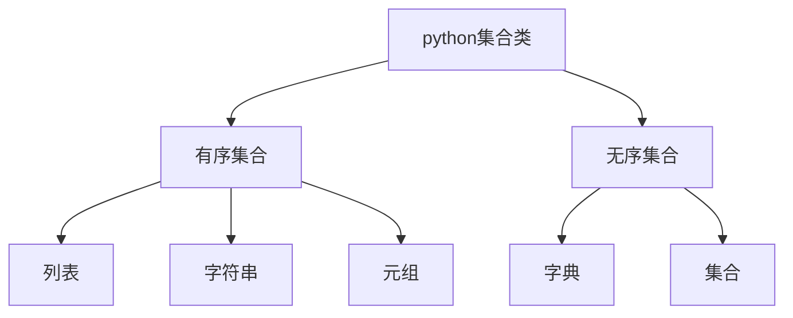

# 推荐两本口碑爆棚的Python算法&数据结构书。

* **1. 算法图解**
* **2.Problem Solving with Algorithms and Data Structures Using Python SECOND EDITION**

* **3.python数据结构与算法分析**

:spider_web:上面书籍的2和3时同一本书

___

下面这个博客可以收藏一下，里面有各种算法书！

https://www.cs.auckland.ac.nz/compsci105s1c/resources/ProblemSolvingwithAlgorithmsandDataStructures.pdf

___

开始学习，小伙伴们！:smile:

____

今日计划

* 数据结构与算法分析 第一章  导论
* data analysis
* 企业画像
* 明天做课题内容（当然可以找一些资料）Xgboosting

那么开始吧！

___

# problem solving with algorithms and data structures using python

___

## 前言：

第一章：背景知识的准备

第二章：算法分析的内在思想

第三——七章：全面的介绍在经典计算机科学问题中出现的数据结构与算法

第八章：选学内容

## 第一章：导论

objective

* 复习计算机科学、编程以及解决问题方面的知识
* 理解抽象这一概念及在解决问题过程中所发挥的作用
* 理解并建立抽象数据类型的概念
* 复习python

jupyter来记代码

md来整理知识点

### 1.3 计算机科学

计算机科学的研究对象是问题、解决问题的过程，以及通过该过程得到的解决方案。给定一个问题，计算机科学家的目标是开发一个能够逐步解决该问题的**算法**。算法是具有有限步骤的过程，依照这个过程便能解决问题。算法就是解决方案。

作者给出的定义:**研究问题及其解决方案，以及研究目前无解的问题的学科。**

#### 1.3.1编程

编程是指通过编程语言将算法编码以使其能被计算机执行的过程。

#### 1.3.2为何学习数据结构及抽象数据类型

这个地方我不知道作者在说什么

#### 1.3.3 为何学习算法

问题通常有很多方案，选择一个解决方案并且确定其为最优秀的方案。

### 1.4 python基础

#### 1.4.1 数据

python支持面向对象编程范式。

类都是idui数据的构成（状态）以及数据能做什么（行为）的描述。由于类的使用者只能看到数据项的状态和行为，因此类与抽象数据类型是相似的。

在面对对象编程范式中，数据项被称作对象，一个对象就是类的一个实例。

* 1.内建原子数据类型
  * 数据类型：int float bool。数值类和布尔类
  * 数学运算符
  * 逻辑运算符

神奇的东西出来了：变量存的是指向数据的引用，而不是数据本身。（动态特性）

* 2.内建集合数据类型
  * 列表、字符串以及元组
    * 彼此有差异的有序集合
  * 集（set）和字典
    * 无序集合

* 列表：零个或多个指向python数据对象的引用的有序集合，通过在方括号内以逗号分隔的一系列值来表达。空列表[]。列表是异构的，意味着其指向的数据对象不需要都是同一个类，可以被赋值给一个变量。

列表有序，支持一系列序列运算。下表所示（**很多东西适用于其他数据类型、字典、集、元组**）

| 运算名 | 运算符 |          解释          |
| :----: | :----: | :--------------------: |
|  索引  |   []   |   取序列中的某个元素   |
|  连接  |   +    |    将序列连接在一起    |
|  重复  |   *    |      重复N次连接       |
|  成员  |   in   | 询问序列中是否有某元素 |
|  长度  |  len   |    询问序列元素个数    |
|  切片  |  [:]   |   取出序列中的一部分   |

page9中小例子在python3.6中不适用

python列表提供的常用方法。下表所示

|   方法名   |         用法         |              解释               |
| :--------: | :------------------: | :-----------------------------: |
| **append** |  alist.append(item)  |        列表尾追加新元素         |
|   insert   | alist.insert(i,item) |       列表i位置插入一元素       |
|    pop     |     alist.pop()      |   删除并返回列表中最后一元素    |
|    pop     |     alist.pop(i)     | 删除并返回列表中第i个位置的元素 |
|    sort    |     alist.sort()     |        将列表中元素排序         |
|  reverse   |   alist.reverse()    |       将列表元素倒序排列        |
|    del     |     del alist[i]     |    删除列表中第i个位置的元素    |
| **index**  |  alist.index(item)   |   返回item第一次出现时的下标    |
|   count    |  alist.count(item)   |   返回item在列表中出现的次数    |
|   remove   |  alist.remove(item)  |  从列表中移除第一次出现的item   |

**list和range组合，会经常碰到。**

* 字符串：零个或多个字母、数字和其他符号的有序集合。里面的字母、数字和其他字符称为字符。

**之前所有序列运算符都能用于字符串**

此外，字符串还提供一些特有的方法。如下表所示

| 方法   | 用法                 | 解释                                                         |
| ------ | -------------------- | ------------------------------------------------------------ |
| center | astring.center(w)    | 返回一个字符串，原字符串居中，使用空格填充新字符串，使其长度为w |
| count  | astring.count(item)  | 返回item出现的次数                                           |
| ljust  | astring.1just(w)     | 返回一个字符串，将原字符串靠左放置并填充空格至长度w          |
| rjust  | astring.rjust(w)     | 返回一个字符串，将原字符串靠右放置并填充空格至长度w          |
| lower  | astring.lower()      | 小写                                                         |
| upper  | astring.upper()      | 大写                                                         |
| find   | astring.find(item)   | 返回item第一次出现的下标                                     |
| split  | astring.split(schar) | 在schar位置将字符串分割                                      |

:spider_web:split在处理数据非常有用，split接受一个字符串，返回一个由分隔符作为分割点的字符串列表，因此split方法也可以是制表符、换行符和空格等空白字符。

:spider_web:列表和字符串的主要区别在于，**列表能够被修改，字符串则不能**。列表的这一特性被称为**可修改性**。

* 元组（tuple）

元组和列表都是异构数据序列，元组和列表非常相似，但不同的是不可修改（字符串）。元组通常写成由括号包含并且以逗号分隔的一系列值。

**元组允许支持一系列序列运算，和列表一样。**

* 集（set）是由零个或多个不可修改的python数据对象组成的无序集合。set无重复元素。表示方法：`set()`
* tip：类似于数学中的集合来理解，轻松搞定

python中集支持的运算

| 运算名 |     运算符     |                   解释                   |
| :----: | :------------: | :--------------------------------------: |
|  成员  |       in       |              成员，返回bool              |
|  长度  |      len       |                 元素个数                 |
|   \|   | aset \| othset |                两set之和                 |
|   &    | aset & othset  |                两set交集                 |
|   -    | aset - othset  |          返回只出现aset中的元素          |
|   <=   | aset <= othset | 判断aset中所有元素都在othset中，返回bool |
| **^**  | aset ^ othset  |          返回除交集以外所有元素          |

python提供的方法

|    方法名    |           用法            |          解释          |
| :----------: | :-----------------------: | :--------------------: |
|    union     |    aset.union(othset)     |       类似于 \|        |
| intersection | aset.intersection(othset) |   并集（共有的部分）   |
|  difference  |  aset.difference(othset)  |        类似于 -        |
|   issubset   |   aset.issubset(othset)   |   前者是否为后者子集   |
|     add      |      aset.add(item)       |    aset添加一个元素    |
|    remove    |     aset.remove(item)     |          移除          |
|     pop      |        aset.pop()         | 随机移除aset中某一元素 |
|    clear     |       aset.clear()        |  清除aset中的所有元素  |

* 字典：无序结构，元素对构成，键值对（键：值）。

* tip：通过键访问其对应的值，也可以向字典中添加新的键值对。
* 其实，访问字典的语法与访问序列的语法相似。是通过**键**来访问，而不是通过**下标**。
* 键的位置是由散列来决定的。len函数对字典的功能对其他集合的功能相同。
* 字典既有运算符，又有方法。

python字典支持的运算

| 运算名 |     运算符     |       解释       |
| :----: | :------------: | :--------------: |
|   []   |   myDict[k]    | 返回与键相同的值 |
|   in   |  key in adict  |       成员       |
|  del   | del adict[key] |       删除       |
|  len   |   len(adict)   |     字典长度     |

python字典提供的方法

| 方法名 | 用法             | 解释                        |
| ------ | ---------------- | --------------------------- |
| keys   | adict.keys()     | 返回键（dict_keys对象）     |
| values | adict.values()   | 返回值(dict_values对象)     |
| items  | adict.items()    | 返回字典(dict_items对象)    |
| get    | adict.get(k)     | 返回k对应的值，无则返回None |
| get    | adict.get(k,alt) | 返回k对应的值，无则返回alt  |

#### 1.4.2 输入与输出

用户交互。提示字符串`input()`

格式化字符串可用的类型

| 字符 | 输出格式                                                    |
| ---- | ----------------------------------------------------------- |
| d、i | 整数                                                        |
| u    | 无符号整数                                                  |
| f    | m.dddd格式的浮点数                                          |
| e    | m.ddddE+/-xx格式的浮点数                                    |
| E    | m.dddde+/-xx格式的浮点数                                    |
| g    | 对指数小于-4或者大于5的使用%e，否则使用%f                   |
| c    | 单个字符                                                    |
| s    | 字符串，或者任意可以通过str函数转换成字符串的python数据对象 |
| %    | 插入一个常量%符号                                           |

格式化修改符

| 修改符     | 例子     | 解释                                  |
| ---------- | -------- | ------------------------------------- |
| 数字       | %20d     | 20个字符串宽的区域中                  |
| -          | %-20d    | 20个字符串宽的区域中。左对齐          |
| +          | %+20d    | 20个字符串宽的区域中。右对齐          |
| 0          | %020d    | 20个字符串宽的区域中。前面补零        |
| .          | %20.2f   | 20个字符串宽的区域中。保留小数点后2位 |
| **(name)** | %(name)d | 字典中name键对应的值                  |

#### 1.4.3 控制结构

控制结构：迭代和分支

:spider_web:attention：列表解析式

~~~python
#列表解析式
sqlist=[x*x for x in range(5)]
sqlist
~~~

#### 1.4.4 异常处理

* 语法错误

~~~
  File "<ipython-input-12-b3415ab79254>", line 2
    for i in range(10)
                      ^
SyntaxError: invalid syntax
~~~

* 逻辑错误

异常发生时，程序抛出异常。用`try`语句来处理异常。

~~~python
anumber=int(input("please enter an integer "))
#learn english (math domain)
#不会写啊
import math
try:
    print(math.sqrt(anumber))
except:
    print('bad value for square root')
    print("using absolute value instead")
    print(math.sqrt(abs(anumber)))
~~~

except会捕捉到sqrt抛出的异常并打印提示信息。意味着程序并不会终止，而是继续执行后续语句。

___

也可以使用`raise`语句来触发运行时异常，下面的例子是创建新的RuntimeError异常的结果

~~~python
#异常处理
anumber=int(input("please enter an integer "))
if anumber < 0:
    raise RuntimeError("you can't use a negative number")
else:
    print(math.sqrt(anumber))
~~~

#### 1.4.5定义函数

~~~python
#通过牛顿迭代法求解平方根，搞不懂。功力尚浅
def squareroot(n):
    root=n/2
    for k in range(20):
        root = (1/2)*(root+(n/root))
        
    return root
squareroot(9)
~~~

#### 1.4.6python面向对象编程：定义类

**1.定义类**

面向对象编程语言最强大的一项特性是允许程序员创建全新的类对求解问题所需的数据进行建模。

python中定义新类的做法是，提供一个类名以及一整套与函数定义语法类似的方法定义。

~~~python
class Fraction:
	#方法定义
~~~

所有类首先都先提供构造方法。创建一个Fraction对象，提供分子分母两部分数据。在python中，构造方法总是命名`__init__`，如下所示。

~~~python
class Fraction:
    def __init__(self,top ,bottom):# 构造方法
        self.num=top
        self.den=bottom
    def show(self):
        print(self.num,"/",self.den)
    def __str__(self):
        return str(self.num)+"/"+str(self.den)
    
    def __add__(self,otherfraction):
        newnum=self.num * otherfraction.den +self.den*otherfraction.num
        newden=self.den * otherfraction.den
        #欧几里得算法寻找最大公约数
        common=gcd(newnum,newden)
        return Fraction (newnum//common,newden//common)
    def __eq__(self,other):
        firstnum=self.num*other.den
        secondnum=self.den*other.num
        
        return firstnum== secondnum
#__________________________________________________________________
def gcd(m,n): #find num and den's greatest common divisor(最大公约数)函数
    while m%n != 0:
        oldm=m
        oldn=n

        m=oldn
        n=oldm%oldn
    return n

myfraction=Fraction(3,5)
myfraction.show()
print(myfraction)
f1=Fraction(1,4)
f2=Fraction(3,4)
f3=f1+f2
print(f3)
f4=Fraction(2,8)
print(f1==f4)
print(f1.__eq__(f4))
~~~

:spider_web:self是一个总是指向对象本身的特殊函数。他必须是第一个形式参数。

:spider_web:类通过方法创建了对象。

:spider_web:`__add__`方法实现

:spider_web:欧几里得算法寻找最大公因数

对于整数m和n，如果m能被n整除，那么他们的最大公因数就是n。如果m不能被n整除，那么结果是n与m除以n的余数的最大公因数。上述gcd为迭代实现。

:spider_web:深浅相等

有两个Fraction对象，只有他们是同一个对象的引用时。f1==f2才为True，浅相等。下图实现不同引用但值相同的深相同。`__eq__`

**2.继承：逻辑门与电路**

继承使一个类与另一个类相关联，类似于孩子从父母那里继承了特征。

python中的子类可以从父类继承特征数据和行为。父类称为超类。

下图表示python中集合类的继承层次结构（有序和无序的区别：**无序是指数据存入的顺序跟取出的顺序不一致**）

~~~python
#set为无序的,输入数据后会重新排列
a=set(['lsi',3,5,2,238,1])
#dict也是无序的，通过键值对来找
adict={'name':'hd ' ,
       'age':12,
       'hobby': 'basketball'
       }
print(adict)
#有序的：列表、元组、字符串
astr='hefhkakd'
print(astr[2])
atuple=(1,'4r','33r',3,4)
print(atuple[1])
alist=[1,2,'daad',5,6,7]
print(alist[2])
~~~

下面介绍逻辑门的继承层次结构

~~~mermaid
graph TD
id1[LogicGate]--> id2[BinaryGate]
id2--> id5[与门]  
id2--> id4[或门] 
id1[LogicGate]--> id3[unaryGate]
id3--> id6[非门]
~~~

~~~python
class LogicGate:
    def __init__(self,n):
        self.label=n
        self.output=None
    def getLabel(self):
        return self.label 
    def getOutput(self):
        self.output=self.performGateLogic()
        return self.output
    
class BinaryGate(LogicGate):
    def __init__(self,n):
        super().__init__(n)
        self.pinA=None
        self.pinB=None
    def getPinA(self):
        return int(input('enter pin a input for gate'+\
                        self.getLabel()+'-->'))
    def getPinB(self):
        return int(input('enter pin b input for gate'+\
                        self.getLabel()+'-->'))
    
class UnaryGate(LogicGate):
    def __init__(self,n):
        super().__init__(n)
        self.pin=None
    def getPin(self):
        return int(input('enter pin input for gate'+\
                        self.getLabel()+'-->'))

class AndGate(BinaryGate):
    def __init__(self,n):
        super().__init__(n)
    def performGateLogic(self):
        a=self.getPinA()
        b=self.getPinB()
        if a==1 and b==1:
            return 1
        else:
            return 0
    
    
    
    #或门的验证
class OrGate(BinaryGate):
    def __init__(self,n):
        super().__init__(n)
    def performGateLogic(self):
        a=self.getPinA()
        b=self.getPinB()
        if a==1 or b==1:
            return 1
        else:
            return 0

#非门的验证
class NotGate(UnaryGate):
    def __init__(self,n):
        super().__init__(n)
    def performGateLogic(self):
        a=self.getPin()
        if a==1:
            return 0
        else:
            return 1

g3=NotGate('G3')
g3.getOutput()
~~~

HAS-A关系 （HAS-A意即“有一个”）
 连接器

~~~python
# 超类LogicGate
class LogicGate:

    def __init__(self,n):
        self.label = n
        self.output = None
    
    def getLabel(self):
        return self.label
        
    def getOutput(self):
        self.output = self.performGateLogic()
        return self.output
        
# 二引脚逻辑门
class BinaryGate(LogicGate):

    def __init__(self,n):
        super().__init__(n)
        
        self.pinA = None
        self.pinB = None
        
    def getPinA(self):
        if self.pinA == None:
            return int(input("Enter Pin A for gate" + self.getLabel() + "-->"))
        else:
            return self.pinA.getFrom().getOutput()
        
    def getPinB(self):
        if self.pinB == None:
            return int(input("Enter Pin B for gate" + self.getLabel() + "-->"))
        else:
            return self.pinB.getFrom().getOutput()

    def setNextPin(self,source):
        if self.pinA == None:
            self.pinA = source
        else:
            if self.pinB == None:
                self.pinB = source
            else:
                raise RuntimeError("Error: NO EMPTY PINS")
        

# 单引脚逻辑门
class UnaryGate(LogicGate):
    
    def __init__(self,n):
        super().__init__(n)
        
        self.pin = None
        
    def getPin(self):
        if self.pin == None:
            return int(input("Enter Pin for gate" + self.getLabel() + "-->"))   
        else:
            return self.pin.getFrom().getOutput()
        
    def setNextPin(self,source):
        if self.pin == None:
            self.pin = source
        else:
            print("Cannot Connect: NO EMPTY PINS on this gate")
        
# 与门
class AndGate(BinaryGate):
    
    def __init__(self,n):
        super().__init__(n)
        
    def performGateLogic(self):
        self.pinA = self.getPinA()
        self.pinB = self.getPinB()
        if self.pinA == 1 and self.pinB == 1:
            return 1
        else:
            return 0
            
# 与非门
class NandGate(BinaryGate):
    
    def __init__(self,n):
        super().__init__(n)
    
    def performGateLogic(self):
        self.pinA = self.getPinA()
        self.pinB = self.getPinB()
        if self.pinA == 1 and self.pinB == 1:
            return 0
        else:
            return 1
            
# 或非门
class NorGate(BinaryGate):
    
    def __init__(self,n):
        super().__init__(n)
    
    def performGateLogic(self):
        self.pinA = self.getPinA()
        self.pinB = self.getPinB()
        if self.pinA == 0 and self.pinB == 0:
            return 1
        else:
            return 0
    
 
# 或门
class OrGate(BinaryGate):
    
    def __init__(self,n):
        super().__init__(n)
        
    def performGateLogic(self):
        self.pinA = self.getPinA()
        self.pinB = self.getPinB()
        if self.pinA == 1 or self.pinB == 1:
        # pinA = self.getPinA()
        # pinB = self.getPinB()
        # if pinA == 1 or pinB == 1:
            return 1
        else:
            return 0 
            
# 异或门
class NorGate(BinaryGate):
    
    def __init__(self,n):
        super().__init__(n)
    
    def performGateLogic(self):
        self.pinA = self.getPinA()
        self.pinB = self.getPinB()
        if self.pinA == self.pinB:
            return 0
        else:
            return 1
            
# 非门
class NotGate(UnaryGate):
    def __init__(self,n):
        super().__init__(n)
        
    def performGateLogic(self):
        self.pin = self.getPin()
        if self.pin==1:
            return 0
        else:
            return 1

class Connector():
    def __init__(self,fgate,tgate):
        self.fromgate = fgate
        self.togate = tgate
        
        tgate.setNextPin(self)
        
    def getFrom(self):
        return self.fromgate
     
    def getTo(self):
        return self.togate
        

if __name__=="__main__":
    g1 = AndGate("G1")
    g2 = AndGate("G2")
    g3 = OrGate("G3")
    g4 = NotGate("G4")
    
    c1 = Connector(g1,g3)
    c2 = Connector(g2,g3)
    c3 = Connector(g3,g4)
    
    print(g4.getOutput())
~~~

