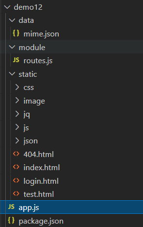

#### 1.web服务器简介

web服务器一般指网站服务器，是指驻留在因特网上某种类型的计算机程序。

* 可以向浏览器等web提供文档；

* 也可以放置文件（网站、数据）。

当下主流的web服务器有Apache、Nginx、IIS

主要功能：

* 访问服务器上面的网站
* 下载文件

#### 2.nodejs创建一个静态web服务器

使用到的模块:http、path、fs、url（URL类）

* 根据响应头读取各种类型文件，显示网页
* 根据路由获取数据，显示网页

路由：路由（Routing）是由一个 **URI**（或者叫路径）和一个特定的 **HTTP** 方法（GET、POST 等）组成 的，涉及到应用如何**响应客户端对某个网站节点的访问**。

**主要功能**：静态显示网页、根据路由显示不同页面数据

文件目录如下：mime.json为请求头和文件对应信息、routes.js放置路由的处理、static目录为静态资源

:family:方式1：解决初始化无法显示静态网页（index.html）的问题。route.static返回资源页面查找失败标识（flag），app.js接收到失败标识后再进行后续路由处理。

~~~javascript
//app.js
const http = require('http');
const path = require('path');
const url = require('url');
const routes = require('./module/routes');
http.createServer(function (req, res) {   
    //创建静态web服务 
    var flag = false;
    flag=routes.static(req,res,'static');
    //路由
    let pathname=url.parse(req.url).pathname;
    
    let extname = path.extname(pathname);
    if(!flag){ //如果有请求地址有后缀名的话让静态web服务去处理 
        if(pathname=='/login'){
            res.writeHead(200, { 'Content-Type': 'text/html;charset="utf-8"' });
            res.end("执行登录");
        }else if(pathname=='/register'){
            res.writeHead(200, { 'Content-Type': 'text/html;charset="utf-8"' });
            res.end("执行注册");
        }else if(pathname=='/admin'){
            res.writeHead(200, { 'Content-Type': 'text/html;charset="utf-8"' });
            res.end("处理后的业务逻辑");
        }else{
            res.writeHead(404, { 'Content-Type': 'text/html;charset="utf-8"' });
            res.end("404");
        }
    }
}).listen(3000);
console.log('Server running at http://127.0.0.1:3000/');
~~~

~~~javascript
//routes.js
const fs = require('fs');
const path = require('path');
const url = require('url');
//私有方法
let getFileMime = function (extname) {
    var data = fs.readFileSync('./data/mime.json'); //同步方法
    let mimeObj = JSON.parse(data.toString());
    return mimeObj[extname];
}
exports.static = function (req, res, staticPath) {
    //1、获取地址
    var pathname = url.parse(req.url).pathname;
    pathname=(pathname=='/'?'/index.html':pathname);
    var extname = path.extname(pathname);
    console.log(extname,pathname)
    if (extname) {  //如果有后缀名让静态web处理 否则路由处理
        //2、通过fs模块读取文件
        
        if (pathname != '/favicon.ico') {
            try {
                let data = fs.readFileSync('./' + staticPath + pathname);
                if (data) {
                    let mime = getFileMime(extname);
                    res.writeHead(200, {'Content-Type': '' + mime + ';charset="utf-8"' });
                    res.end(data);
                    return true
                }
            } catch (error) {
                console.log(error)
            }
        }
        return false
    }
}
~~~

:family:方式2：解决初始化无法显示静态网页（index.html）的问题。在routes.js中处理剩下的逻辑路由。

~~~javascript
//app.js
const http = require('http');
const path = require('path');
const url = require('url');
const routes = require('./module/routes');
http.createServer(function (req, res) {   
    //创建静态web服务
    routes.static(req,res,'static');
}).listen(3000);
console.log('Server running at http://127.0.0.1:3000/');
~~~

~~~javascript
//routes.js
const fs = require('fs');
const path = require('path');
const url = require('url');
//私有方法
let getFileMime = function (extname) {
    var data = fs.readFileSync('./data/mime.json'); //同步方法
    let mimeObj = JSON.parse(data.toString());
    return mimeObj[extname];
}

exports.static = function (req, res, staticPath) {
    //1、获取地址
    let pathname = url.parse(req.url).pathname;
    pathname=(pathname=='/'?'/index.html':pathname);
    console.log(pathname)
    let extname = path.extname(pathname);
    console.log(extname)

    if (extname) {  //如果有后缀名让静态web处理 否则路由处理
        //2、通过fs模块读取文件
        if (pathname != '/favicon.ico') {
            try {
                let data = fs.readFileSync('./' + staticPath + pathname);
                if (data) {                 
                    let mime = getFileMime(extname);
                    res.writeHead(200, { 'Content-Type': '' + mime + ';charset="utf-8"' });
                    res.end(data);
                    return
                }
            } catch (error) {
                console.log(error)          
            }
        }
    }else{
        //路由
        let pathname=url.parse(req.url).pathname;
        console.log(pathname)
        let extname = path.extname(pathname);
        if(!extname){ //如果有请求地址有后缀名的话让静态web服务去处理 
            if(pathname=='/login'){
                res.writeHead(200, { 'Content-Type': 'text/html;charset="utf-8"' });
                res.end("执行登录");
            }else if(pathname=='/register'){
                res.writeHead(200, { 'Content-Type': 'text/html;charset="utf-8"' });
                res.end("执行注册");
            }else if(pathname=='/admin'){
                res.writeHead(200, { 'Content-Type': 'text/html;charset="utf-8"' });
                res.end("处理后的业务逻辑");
            }else{
                res.writeHead(404, { 'Content-Type': 'text/html;charset="utf-8"' });
                res.end("404");
            }
        }
    }
}
~~~

